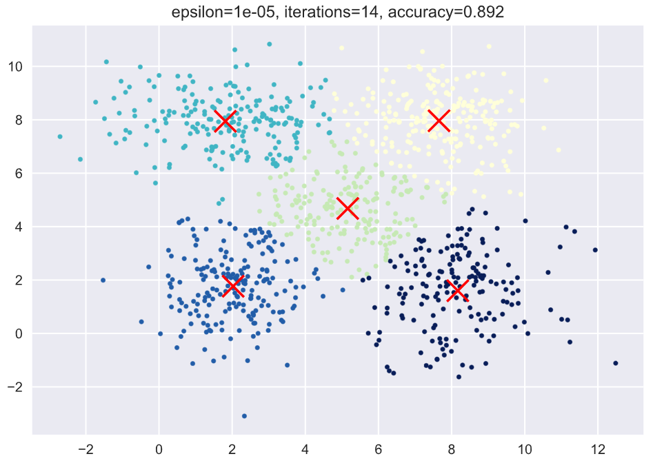

<br/>
<br/>

<div align=center></div>

<br/>

<center> <font size = 6>2020年春季学期 </font></center>
<center> <font size = 6>计算学部《机器学习》课程 </font></center>

<br/>
<br/>

<center> <font size = 6> Lab3 实验报告 </font></center>

<br/>
<br/>
<br/>
<br/>
<br/>
<br/>
<br/>
<br/><br/>
<br/><br/><br/>
<br/>

<center> <font size = 3> 
<table>
   <tr>
      <td>姓名</td>
      <td>郭茁宁</td>
   </tr>
   <tr>
      <td>学号</td>
      <td>1183710109</td>
   </tr>
   <tr>
      <td>班号</td>
      <td>1837101</td>
   </tr>
   <tr>
      <td>电子邮件</td>
      <td>gzn00417@foxmail.com</td>
   </tr>
</table>
</font></center>
<br/>
<br/>

<div STYLE="page-break-after: always;"></div>

<!-- 此处用于换行 -->

# 1 实验目的

实现一个 k-means 算法和混合高斯模型，并且用 EM 算法估计模型中的参数。

# 2 实验要求及实验环境

## 2.1 实验要求

测试：用高斯分布产生 k 个高斯分布的数据（不同均值和方差）（其中参数自己设定）。

（1）用 k-means 聚类，测试效果；

（2）用混合高斯模型和你实现的 EM 算法估计参数，看看每次迭代后似然值变化情况，考察 EM 算法是否可以获得正确的结果（与你设定的结果比较）。

应用：可以 UCI 上找一个简单问题数据，用你实现的 GMM 进行聚类。

## 2.2 实验环境

Windows 10, Python 3.6.11, Jupyter notebook

# 3 实验原理

本实验分为两部分：K-means 和 GMM，这两部分都是属于 EM 算法，而 EM 算法主要分为两步：

- E 步：求期望
- M 步：求最大似然

E 步是调整分布，M 步是根据 E 步得到的分布求得当前分布下取到最大似然时的参数，然后更新参数，再次进入 E 步根据得到的参数调整新的分布，如此往复循环，直到参数收敛。

## 3.1 K-means

给定训练样本$X=\{x_1, x_2, ..., x_m\}$，和划分聚类的数量 $k$，给出一个簇划分$C=C_1,C_2,...,C_k$，使得该划分的平方误差$E$最小化，即使下式取最小值：

$$
E=\sum^k_{i=1}\sum_{x\in C_i}||x-\mu_i||^2_2
$$

其中，$\mu_i=\frac 1 {|C_i|}\sum_{x\in C_i}x_i$，它是簇$C_i$的均值向量。$E$刻画了簇内样本围绕簇的均值向量的紧密程度，$E$越小簇内样本的相似度越高。

具体迭代过程如下：

1. 根据输入的超参数$K$首先初始化一些向量（可以从现有的向量中挑选），作为各簇的均值向量。
2. 根据初始化的均值向量给出训练样本的一个划分，计算各个训练样本到各个均指向量的距离，找出距离最近的均值向量，并将该样本分至该均值向量所代表的簇。
3. 根据新的簇划分，重新计算每个簇的均值向量，如果新的均值向量与旧的均值向量差小于$\varepsilon$，则认为算法收敛；否则，更新均值向量，回到第 2 步重新迭代求解。

K-means 算法的流程图如下：

```flow
st=>start: Start
in=>inputoutput: 输入期望的聚类数K
init=>operation: 随机选取K个样本为初始聚类中心
eStep=>operation: 遍历样本，根据样本到每个
中心的距离确定它的标签
mStep=>operation: 根据得到的标签重新计算样本中心
cond=>condition: 聚类中心收敛?
e=>end
st->in->init->eStep->mStep->cond
cond(yes)->e
cond(no)->eStep
```

K-means 实现：

```python
def kmeans(X, k, epsilon=1e-5):
    """
    K-means算法实现，算得分类结果和中心
    """
    center = np.zeros((k, X.shape[1]-1))
    for i in range(k):
        center[i,:] = X[np.random.randint(0, high=X.shape[0]),:-1]
    while True:
        distance = np.zeros(k)
        # 根据中心重新给每个点贴分类标签
        for i in range(X.shape[0]):
            for j in range(k):
                distance[j] = np.linalg.norm(X[i,:-1] - center[j, :])
            X[i, -1] = np.argmin(distance)
        # 根据每个点新的标签计算它的中心
        new_center = np.zeros((k, X.shape[1]-1))
        count = np.zeros(k)
        for i in range(X.shape[0]):
            new_center[int(X[i, -1]), :] += X[i, :-1] # 对每个类的所有点坐标求和
            count[int(X[i, -1])] += 1
        for i in range(k):
            new_center[i, :] = new_center[i, :] / count[i] # 对每个类的所有点坐标求平均值
        if np.linalg.norm(new_center - center) < epsilon: #用差值的二范数表示精度
            break
        else:
            center = new_center
    return X, center
```

## 3.2 GMM

多元高斯分布生成的 $d$ 维随机变量 $x$ 的密度函数为：

$$
p(x|\mu, \Sigma)=\frac 1 {(2\pi)^\frac d 2 |\Sigma|^\frac 1 2}\exp(-\frac 1 2(x-\mu)^T\Sigma^{-1}(x-\mu))
$$

其中 $\mu$ 为 $d$ 维的均值向量，$\Sigma$ 为 $d\times d$ 的协方差矩阵。

给定训练样本集 $X=\{x_1, x_2, ..., x_n\}$，它是一个 $n\times d$ 的矩阵，$n$ 为样本数量，$d$ 为单个样本的维度数量。对于一个样本 $x_i$，我们可以认为它是由多个对应维度的多元高斯分布所生成，所以⾼斯分布的线性叠加来表征数据，假设数据由 $k$ 个高斯分布混合生成：

$$
p(x_i)=\sum^k_{j=1}\pi_jp(x_i|\,u_j, \Sigma_j)
$$

其中 $\mu_j$ 和 $\Sigma_j$ 是第 $j$ 个高斯分布的均值和协方差矩阵，$\pi_j$ 为相应的混合系数，满足$\displaystyle\sum^k_{j=1}\pi_j=1$
。因此，我们也可以认为该数据的生成相当于从 $k$ 个高斯分布中挑选出一个所生成，我们设 $k$ 维二值变量 $z$，这个变量采⽤了 “$1-of-k$” 表⽰⽅法，其中⼀个特定的元素 $z_j$ 等于 1，其余所有的元素等于 0。于是 $z_j$ 的值满⾜ $z_j \in \{0, 1\}$ 且 $\displaystyle\sum_j z_j=1$，则 $\pi_j$ 加权平均概率值可以表征 $z$ 的分布，也就是说 $z$ 的先验分布为：

$$
p(z)=\prod^k_{j=1} \pi^{z_j}_j
$$

而在看到 $x_i$ 的情况下 $z$ 的后验概率为：

$$
\gamma(z_j)\equiv p(z_j = 1|x_i) =
\frac{p(z_j = 1)p(x_i|z_j = 1)}{p(x_i)}
= \frac{\pi_jp(x_i|\mu_j, \Sigma_j)}{\sum\limits_{l=1}^k\pi_lp({x_i}|{\mu_l}, \Sigma_j)}
$$

当后验概率已知时，混合高斯模型将训练样本划分成了 $k$ 个簇 $C = C_1, C_2, ... , C_k$，对于每一个样本 $x_i$，其类别为 $j$，满足$j=\arg\displaystyle\max_j \gamma(z_j)$，即选择后验概率最大的类别作为标签类别。因此，当我们观测到样本集 $X$ 时可以采用极大似然估计来求解样本的类别分布：

$$
\ln p(X|\pi, \mu, \Sigma) = \ln \prod_{i=1}^n p(x_i)=\sum_{i=1}^n\ln \sum^k_{j=1}\pi_jp(x_i|\,u_j, \Sigma_j)
$$

使上式最大化，对 $\mu_j$ 求导令导数为 0：

$$
\frac {\partial \ln p(X|\pi, \mu, \Sigma)} {\partial \mu_j}
= \sum_{i=1}^n \frac{\pi_j p(x_i| \mu_j, \Sigma_j)}{\displaystyle\sum_{l=1}^k \pi_l p(x_i| \mu_l, \Sigma_l)} \Sigma_j^{-1}(x_i - \mu_j) = 0
$$

令

$$
\gamma(z_{ij}) =\frac {p(z_j = 1|x_i)}{\displaystyle\sum_{j=1}^k p(z_j = 1|x_i)}=\frac{\pi_j p(x_i| \mu_j, \Sigma_j)}{\displaystyle\sum_{l=1}^k \pi_l p(x_i| \mu_l, \Sigma_l)}
$$

则上式解得

$$
n_j = \sum_i \gamma(z_{ij})\\
\mu_j = \frac 1 {n_j}\sum_{i=1}^n\gamma(z_{ij})x_i
$$

同理，对 $\Sigma_j$ 求导令导数为 0：

$$
\frac {\partial \ln p(X|\pi, \mu, \Sigma)} {\partial \Sigma_j}
= \sum_{i=1}^n \frac{\pi_j p(x_i| \mu_j, \Sigma_j)}{\displaystyle\sum_{l=1}^k \pi_l p(x_i| \mu_l, \Sigma_l)} (\Sigma_j^{-1} - \Sigma_j^{-1}(x_i -\mu_j)(x_i -\mu_j)^T\Sigma_j^{-1}) = 0
$$

解得

$$
\Sigma_j = \frac {\displaystyle\sum_{i=1}^n\gamma(z_{ij})(x_i -\mu_j)(x_i -\mu_j)^T} {n_j}
$$

对于混合系数 $\pi_j$，还需要满足约束条件 $\displaystyle\sum^k_{j=1}\pi_j=1$。构造拉格朗日多项式：

$$
\ln p(X|\pi, \mu, \Sigma) + \lambda(\sum_{j=1}^k \pi_j - 1)
$$

对 $\pi_j$ 求导，令导数为 0：

$$
\frac {\partial \ln p(X|\pi, \mu, \Sigma) + \lambda(\displaystyle\sum_{j=1}^k \pi_j - 1)} {\partial \pi_j}
=\sum_{i=1}^n \frac{p(x_i| \mu_j, \Sigma_j)}{\displaystyle\sum_{l=1}^k \pi_l p(x_i| \mu_l, \Sigma_l)} + \lambda = 0
$$

同乘 $\pi_j$ 并将 $j \in \{1,2,...,k\}$ 代入相加得：

$$
\sum_{j=1}^k \pi_j \frac{p(x_i| \mu_j, \Sigma_j)}{\displaystyle\sum_{l=1}^k \pi_l p(x_i| \mu_l, \Sigma_l)} + \lambda\sum_{j=1}^k \pi_j = 0
$$

将约束条件代入：

$$
\sum_{i=1}^n (\frac{\displaystyle\sum_{j=1}^k \pi_j p(x_i| \mu_j, \Sigma_j)}{\displaystyle\sum_{l=1}^k \pi_l p(x_i| \mu_l, \Sigma_l)}) + \lambda\sum_{j=1}^k \pi_j = n + \lambda = 0
$$

即 $\lambda = -n$，代入 $\displaystyle\sum_{i=1}^n \frac{p(x_i| \mu_j, \Sigma_j)}{\displaystyle\sum_{l=1}^k \pi_l p(x_i| \mu_l, \Sigma_l)} + \lambda = 0$ 中，得

$$
\pi_j = \frac {n_j}{n}
$$

GMM 算法过程如下：

1. 随机初始化参数 $\pi_i, \mu_i, \Sigma_i,\ \ i\in \{1,2, ... ,k\}$

2. E 步：根据式 $\gamma(z_j)= \frac{\pi_jp(x_i|\mu_j, \Sigma_j)}{\sum\limits_{l=1}^k\pi_lp({x_i}|{\mu_l}, \Sigma_j)}$ 计算每个样本由各个混合高斯成分生成的后验概率

3. M 步：用下式更新参数 $\pi_i, \mu_i, \Sigma_i,\ \ i\in \{1,2, ... ,k\}$

   $$
   \pi_j = \frac {n_j}{n}\\
   \mu_j = \frac 1 {n_j}\sum_{i=1}^n\gamma(z_{ij})x_i\\
   \Sigma_j = \frac {\displaystyle\sum_{i=1}^n\gamma(z_{ij})(x_i -\mu_j)(x_i -\mu_j)^T} {n_j}
   $$

4. 如果参数值不再发生变化，根据 $j=\arg\displaystyle\max_j \gamma(z_j)$ 计算标签 $j$，否则，返回第 2 步

E 步实现：

```python
def e_step(x, mu_list, sigma_list, pi_list):
    """
    e步，求每个样本由各个混合高斯成分生成的后验概率
    """
    k = mu_list.shape[0]
    gamma_z = np.zeros((x.shape[0], k))
    for i in range(x.shape[0]):
        pi_times_pdf_sum = 0
        pi_times_pdf = np.zeros(k)
        for j in range(k):
            pi_times_pdf[j] = pi_list[j] * multivariate_normal.pdf(x[i], mean=mu_list[j], cov=sigma_list[j])
            pi_times_pdf_sum += pi_times_pdf[j]
        for j in range(k):
            gamma_z[i, j] = pi_times_pdf[j] / pi_times_pdf_sum
```

m 步实现：

```python
def m_step(x, mu_list, gamma_z):
    """
    m步，根据公式更新参数
    """
    k = mu_list.shape[0]
    n = x.shape[0]
    dim = x.shape[1]
    mu_list_new = np.zeros(mu_list.shape)
    sigma_list_new = np.zeros((k, dim, dim))
    pi_list_new = np.zeros(k)
    for j in range(k):
        n_j = np.sum(gamma_z[:, j])
        pi_list_new[j] = n_j / n # 计算新的pi

        gamma = gamma_z[:, j]
        gamma = gamma.reshape(n, 1)
        mu_list_new[j, :] = (gamma.T @ x) / n_j # 计算新的mu
        sigma_list_new[j] = ((x - mu_list[j]).T @ np.multiply((x - mu_list[j]), gamma)) / n_j # 计算新的sigma
    return mu_list_new, sigma_list_new, pi_list_new

```

GMM 主算法：

```python
while True:
    gamma_z = e_step(x, mu_list, sigma_list, pi_list)
    mu_list, sigma_list, pi_list = m_step(x, mu_list, gamma_z)
    new_log_l = log_likelihood(x, mu_list, sigma_list, pi_list)
    if (old_log_l - new_log_l) < epsilon:
        break
```

# 4 实验结果与分析

## 4.1 k=3，各分布距离较远

生成 k=3 的 2 维数据测试 K-Means 和 GMM 的效果，各高斯分布的均值和协方差矩阵均不同。

各高斯分布的均值：[[ 2 6] [ 8 10] [ 8 2]]


### 4.1.1 K-means

下图的各中心坐标：[[ 8.01793576 1.79108972] [ 8.03150573 10.1021806 ] [ 2.24065269 5.92428314]]


下图的各中心坐标：[[ 8.0836514 10.09409582] [ 2.13241573 6.07466331] [ 7.90305055 1.85080409]]


下图的各中心坐标：[[ 7.90305055 1.85080409] [ 2.13241573 6.07466331] [ 8.0836514 10.09409582]]


从图中可以看出，随着精度的增大，准确率都在 0.98，变化不大，但精度从 1 变为 1e-5 时，求得的聚类中心准确度增大了。

### 4.1.2 GMM

| Iterations | log |  likelihood  |
| :--------: | :-: | :----------: |
|     0      |  0  | -6144.654659 |
|     1      | 10  | -2263.041207 |


| Iterations | log |  likelihood   |
| :--------: | :-: | :-----------: |
|     0      |  0  | -12380.649487 |
|     1      | 10  | -2259.168385  |
|     2      | 20  | -2250.432389  |


| Iterations | log |  likelihood   |
| :--------: | :-: | :-----------: |
|     0      |  0  | -12380.649487 |
|     1      | 10  | -2259.168385  |
|     2      | 20  | -2250.432389  |
|     3      | 30  | -2250.427813  |
|     4      | 40  | -2250.427810  |


可以看出，在本条件下，GMM 得到的结果要比 K-means 得到的结果好一些。分类结果都在 0.993 以上，随精度的变化不大，所以推断它已经收敛到了一定程度，甚至各参数不再发生变化，再看各次运行时的最大似然对数，发现最大似然对数确实在增大，而大约从第 30 次迭代开始，就不再发生变化了，这也就解释了为什么在这些精度下不随精度的增大而变化。

## 4.2 k=5，各分布距离较近

生成 k=5 的 2 维数据测试 K-Means 和 GMM 的效果，各高斯分布的均值和协方差矩阵均不同。

各高斯分布的均值：[[2 2] [2 8] [5 5] [8 2] [8 8]]


### 4.2.1 K-means

下图的各中心坐标：[[2.18968489 1.84342438] [4.06214076 6.49533675] [7.70264307 7.75145059] [7.64093616 2.08442801] [0.81632472 7.85715666]]


下图的各中心坐标：[[7.65555593 7.96246481] [5.15908774 4.67890905] [1.81425092 7.94398898] [2.02856111 1.76633677] [8.16967029 1.60086774]]



下图的各中心坐标：[[2.02856111 1.76633677] [7.68489141 8.01662037] [8.13186743 1.61606551] [1.7762265 7.95586774] [5.18796523 4.80202908]]


### 4.2.2 GMM

| Iterations | log |  likelihood   |
| :--------: | :-: | :-----------: |
|     0      |  0  | -14676.491323 |
|     1      | 10  | -4042.639637  |


| Iterations | log |  likelihood  |
| :--------: | :-: | :----------: |
|     0      |  0  | -3707.327401 |
|     1      | 10  | -4066.759192 |
|     2      | 20  | -4064.114970 |
|     3      | 30  | -4052.819666 |
|     4      | 40  | -4033.756962 |
|     5      | 50  | -3990.930686 |
|     6      | 60  | -3946.121933 |
|     7      | 70  | -3955.944642 |
|     8      | 80  | -4010.409120 |
|     9      | 90  | -4039.433624 |
|     10     | 100 | -4048.449899 |
|     11     | 110 | -4050.732952 |
|     12     | 120 | -4051.318926 |
|     13     | 130 | -4051.489652 |
|     14     | 140 | -4051.549530 |
|     15     | 150 | -4051.574484 |
|     16     | 160 | -4051.586110 |
|     17     | 170 | -4051.591836 |
|     18     | 180 | -4051.594721 |
|     19     | 190 | -4051.596187 |
|     20     | 200 | -4051.596933 |
|     21     | 210 | -4051.597313 |
|     22     | 220 | -4051.597507 |
|     23     | 230 | -4051.597605 |
|     24     | 240 | -4051.597655 |
|     25     | 250 | -4051.597680 |
|     26     | 260 | -4051.597693 |
|     27     | 270 | -4051.597700 |
|     28     | 280 | -4051.597703 |
|     29     | 290 | -4051.597705 |
|     30     | 300 | -4051.597706 |
|     31     | 310 | -4051.597706 |
|     32     | 320 | -4051.597706 |
|     33     | 330 | -4051.597706 |
|     34     | 340 | -4051.597706 |
|     35     | 350 | -4051.597706 |
|     36     | 360 | -4051.597706 |
|     37     | 370 | -4051.597706 |
|     38     | 380 | -4051.597706 |
|     39     | 390 | -4051.597706 |
|     40     | 400 | -4051.597706 |
|     41     | 410 | -4051.597706 |
|     42     | 420 | -4051.597706 |
|     43     | 430 | -4051.597706 |
|     44     | 440 | -4051.597706 |
|     45     | 450 | -4051.597706 |
|     46     | 460 | -4051.597706 |
|     47     | 470 | -4051.597706 |
|     48     | 480 | -4051.597706 |
|     49     | 490 | -4051.597706 |
|     50     | 500 | -4051.597706 |


| Iterations | log |  likelihood  |
| :--------: | :-: | :----------: |
|     0      |  0  | -5469.695696 |
|     1      | 10  | -4148.762105 |
|     2      | 20  | -4134.919184 |
|     3      | 30  | -4128.936608 |
|     4      | 40  | -4121.168586 |
|     5      | 50  | -4114.312090 |
|     6      | 60  | -4107.529935 |
|     7      | 70  | -4098.785358 |
|     8      | 80  | -4077.555265 |
|     9      | 90  | -4052.803917 |
|     10     | 100 | -4020.465108 |
|     11     | 110 | -3976.456995 |
|     12     | 120 | -3941.825622 |
|     13     | 130 | -3973.274595 |
|     14     | 140 | -4015.355576 |
|     15     | 150 | -4028.747247 |
|     16     | 160 | -4031.841581 |
|     17     | 170 | -4032.537464 |
|     18     | 180 | -4032.698684 |
|     19     | 190 | -4032.737935 |
|     20     | 200 | -4032.748141 |
|     21     | 210 | -4032.751023 |
|     22     | 220 | -4032.751924 |
|     23     | 230 | -4032.752241 |
|     24     | 240 | -4032.752366 |
|     25     | 250 | -4032.752422 |
|     26     | 260 | -4032.752449 |
|     27     | 270 | -4032.752463 |
|     28     | 280 | -4032.752471 |
|     29     | 290 | -4032.752475 |
|     30     | 300 | -4032.752478 |
|     31     | 310 | -4032.752479 |
|     32     | 320 | -4032.752480 |
|     33     | 330 | -4032.752480 |
|     34     | 340 | -4032.752480 |
|     35     | 350 | -4032.752481 |
|     36     | 360 | -4032.752481 |
|     37     | 370 | -4032.752481 |
|     38     | 380 | -4032.752481 |
|     39     | 390 | -4032.752481 |
|     40     | 400 | -4032.752481 |
|     41     | 410 | -4032.752481 |
|     42     | 420 | -4032.752481 |
|     43     | 430 | -4032.752481 |
|     44     | 440 | -4032.752481 |
|     45     | 450 | -4032.752481 |
|     46     | 460 | -4032.752481 |
|     47     | 470 | -4032.752481 |
|     48     | 480 | -4032.752481 |
|     49     | 490 | -4032.752481 |
|     50     | 500 | -4032.752481 |
|     51     | 510 | -4032.752481 |
|     52     | 520 | -4032.752481 |
|     53     | 530 | -4032.752481 |
|     54     | 540 | -4032.752481 |
|     55     | 550 | -4032.752481 |
|     56     | 560 | -4032.752481 |
|     57     | 570 | -4032.752481 |
|     58     | 580 | -4032.752481 |


可以看出在精度较低时，GMM 的效果并不好，但提高精度后，准确率和大幅度提升，最后比 K-means 的分类效果要好一点。

## 4.3 UCI 数据集

- K-means

[[6.39425287 2.93103448 5.09425287 1.75632184] [5.006 3.418 1.464 0.244 ] [5.37692308 2.47692308 3.64615385 1.13846154]]

[[5.006 3.418 1.464 0.244 ] [5.9016129 2.7483871 4.39354839 1.43387097] [6.85 3.07368421 5.74210526 2.07105263]]

[[5.006 3.418 1.464 0.244 ] [5.9016129 2.7483871 4.39354839 1.43387097] [6.85 3.07368421 5.74210526 2.07105263]]

- GMM

| Iterations | log | likelihood  |
| :--------: | :-: | :---------: |
|     0      |  0  | -242.877279 |
|     1      | 10  | 180.646535  |

| Iterations | log | likelihood  |
| :--------: | :-: | :---------: |
|     0      |  0  | -220.377579 |
|     1      | 10  | 136.639877  |
|     2      | 20  | 178.635141  |
|     3      | 30  | 222.721534  |
|     4      | 40  | 226.810323  |
|     5      | 50  | 228.682437  |
|     6      | 60  | 245.465852  |

| Iterations | log | likelihood  |
| :--------: | :-: | :---------: |
|     0      |  0  | -340.267489 |
|     1      | 10  | 180.479148  |
|     2      | 20  | 167.034569  |
|     3      | 30  | 167.032893  |
|     4      | 40  | 167.032705  |
|     5      | 50  | 167.032697  |
|     6      | 60  | 167.032696  |
|     7      | 70  | 167.032696  |
|     8      | 80  | 167.032696  |
|     9      | 90  | 167.032696  |

# 5 结论

K-Means 实际上假设数据式呈球状分布，假设使用的欧式距离来衡量样本与各个簇中心的相似度(假设数据的各个维度对于相似度计算的作用是相同的)，它的簇中心初始化对于最终的结果有很大的影响，如果选择不好初始的簇中心值容易使之陷入局部最优解；与之相比 GMM 使用更加一般的数据表示即高斯分布，GMM 使用 EM 算法进行迭代优化，因为其涉及到隐变量的问题，没有之前的完全数据，而是在不完全数据上进行。

K-Means 其实就是一种特殊的高斯混合模型，假设每种类在样本中出现的概率相等均为 $\frac 1 k$ , 而且假设高斯模型中的每个变量之间是独立的，即变量间的协方差矩阵是对角阵，这样我们可以直接用欧氏距离作为 K-Means 的协方差去衡量相似性；K-Means 对响应度也做了简化，每个样本只属于一个类，即每个样本属于某个类响应度为 1，对于不属于的类响应度设为 0，算是对 GMM 的一种简化。而在高斯混合模型中，每个类的数据出现在样本中的概率为，用协方差矩阵替代 K-Means 中的欧式距离去度量点和点之间的相似度，响应度也由离散的 0，1 变成了需要通过全概率公式计算的值。由于 GMM 不像 K-means 做了很多假设，所以分类最终效果比 K-Means 好，但是 GMM-EM 算法过于细化，容易被噪声影响，所以适合对 K-Means 的分类结果进行进一步优化。
