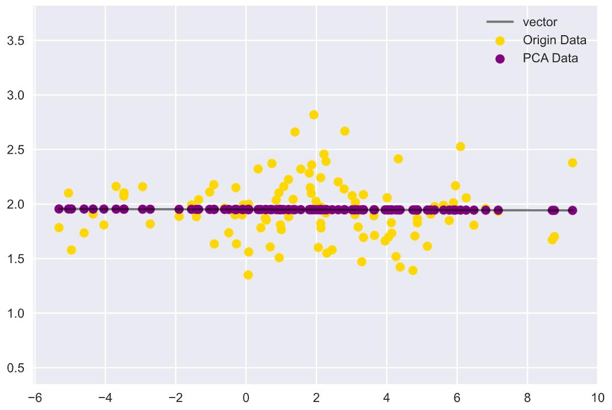
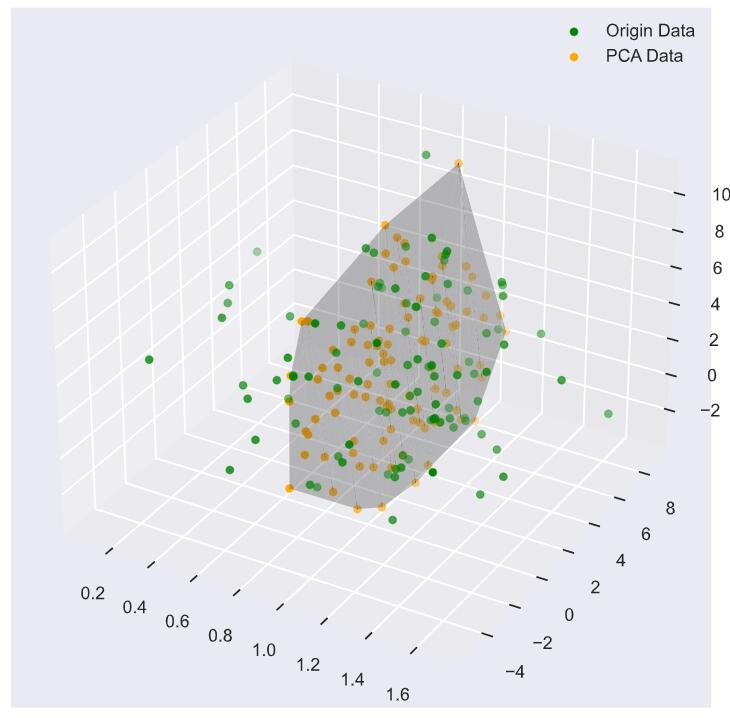
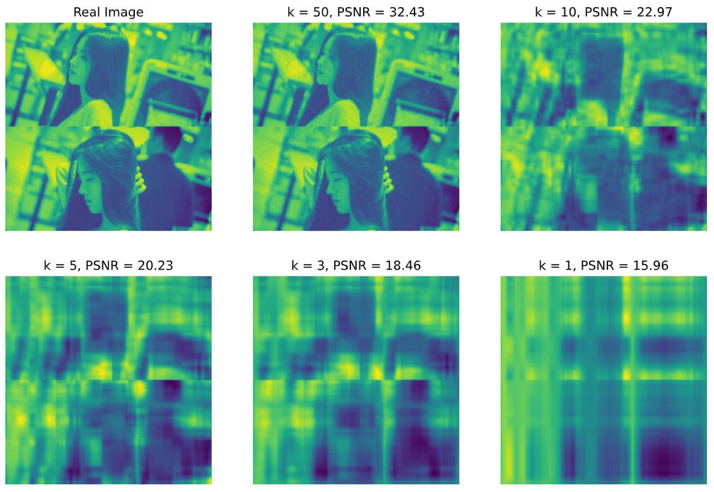
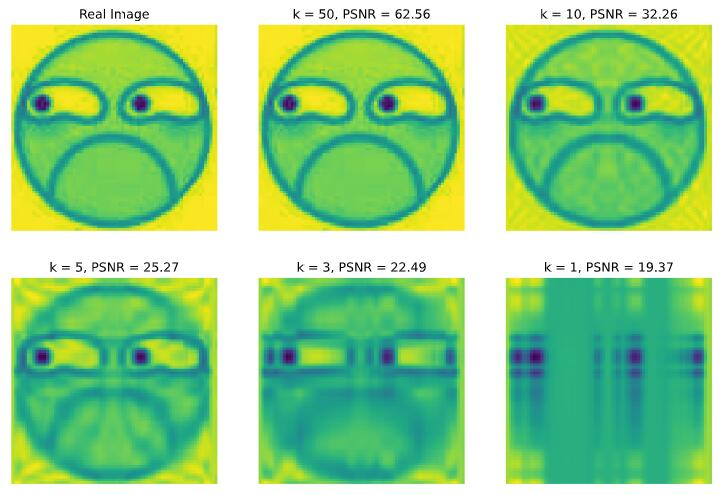
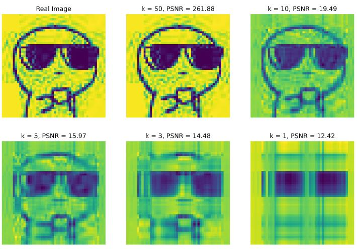

<br/>
<br/>

<div align=center></div>

<br/>

<center> <font size = 6>2020年春季学期 </font></center>
<center> <font size = 6>计算学部《机器学习》课程 </font></center>

<br/>
<br/>

<center> <font size = 6> Lab4 实验报告 </font></center>

<br/>
<br/>
<br/>
<br/>
<br/>
<br/>
<br/>
<br/><br/>
<br/><br/><br/>
<br/>

<center> <font size = 3> 
<table>
   <tr>
      <td>姓名</td>
      <td>郭茁宁</td>
   </tr>
   <tr>
      <td>学号</td>
      <td>1183710109</td>
   </tr>
   <tr>
      <td>班号</td>
      <td>1837101</td>
   </tr>
   <tr>
      <td>电子邮件</td>
      <td>gzn00417@foxmail.com</td>
   </tr>
   <tr>
      <td>手机号码</td>
      <td>13905082373</td>
   </tr>
</table>
</font></center>
<br/>
<br/>

<div STYLE="page-break-after: always;"></div>

<!-- 此处用于换行 -->

# 1 实验目的

实现一个 PCA 模型，能够对给定数据进行降维（即找到其中的主成分）

# 2 实验要求及实验环境

## 2.1 实验要求

测试：

1. 首先人工生成一些数据（如三维数据），让它们主要分布在低维空间中，如首先让某个维度的方差远小于其它唯独，然后对这些数据旋转。生成这些数据后，用你的 PCA 方法进行主成分提取。

2. 找一个人脸数据（小点样本量），用你实现 PCA 方法对该数据降维，找出一些主成分，然后用这些主成分对每一副人脸图像进行重建，比较一些它们与原图像有多大差别（用信噪比衡量）。

## 2.2 实验环境

Windows 10, Python 3.6.11, Jupyter notebook

# 3 实验原理

PCA(主成分分析，Principal Component Analysis)是最常用的一种降维方法。PCA 的主要思想是将 D 维特征通过一组投影向量映射到 K 维上，这 K 维是全新的正交特征，称之为主成分，采用主成分作为数据的代表，有效地降低了数据维度，且保留了最多的信息。关于 PCA 的推导有两种方式：最大投影方差和最小投影距离。

- 最大投影方差：样本点在这个超平面上的投影尽可能分开
- 最小投影距离：样本点到这个超平面的距离都足够近

## 3.1 中心化

在开始 PCA 之前需要对数据进行预处理，即对数据中心化。设数据集 $X=\{x_1, x_2, ..., x_n\}$，其中 $x_i = \{x_{i1}, x_{i2}, ..., x_{id}\}$，即 $X$ 是一个 $n \times d$ 的矩阵。则此数据集的中心向量（均值向量）为：

$$
\mu = \frac 1 n \sum_{i=1}^n x_i
$$

对数据集每个样本均进行操作：$x_i = x_i - \mu$，就得到了中心化后的数据，此时有 $\displaystyle\sum_{i=1}^n x_i=0$。

中心化可以给后面的计算带来极大的便利，因为中心化之后的常规线性变换就是绕原点的旋转变化，也就是坐标变换。此时，协方差为 $S=\displaystyle\frac 1 n\sum_{i=1}^n x_i x_i^T=\frac 1 n X^T X$

设使用的投影坐标系的一组**标准正交基**为 $U_{k\times d}=\{u_1, u_2, ..., u_k\},\ k<d, u_i = \{u_{i1}, u_{i2}, ..., u_{id}\}$，故有 $UU^T=1$，使用这组基变换中心化矩阵 $X$，得降维压缩后的矩阵 $Y_{n \times k}=XU^T$，重建得到 $\hat X=YU=XU^TU$。

## 3.2 最大投影方差

对于任意一个样本 $x_i$，在新的坐标系中的投影为 $y_i=x_iU^T$，在新坐标系中的投影方差为 $y_i^Ty_i=Ux_i^T x_iU^T$。要使所有的样本的投影方差和最大，也就是求 $\displaystyle\arg\max_U \sum^n_{i=1} Ux_i^T x_iU^T$，即

$$
\arg \max_U\ tr(UX^TXU^T)\qquad s.t.\ UU^T=1
$$

求解：在 $u_1$ 方向投影后的方差

$$
\frac 1 n \sum_{i=1}^n\{u_1^Tx_i - u_1^T\mu\}^2 = \frac 1 n (Xu_1^T)^T(Xu_1^T)=\frac 1 n u_1X^TXu_1^T=u_1Su_1^T
$$

因为 $u_1$ 是投影方向，且已经假设它是单位向量，即 $u_1^Tu_1=1$，用拉格朗日乘子法最大化目标函数：

$$
L(u_1) = u_1^TSu_1 + \lambda_1(1-u_1^Tu_1)
$$

对 $u_1$ 求导，令导数等于 0，解得 $Su_1 = \lambda_1 u_1$，显然，$u_1$ 和 $\lambda_1$ 是一组对应的 $S$ 的特征向量和特征值，所以有 $u_1^TSu_1 = \lambda_1$，结合在 $u_1$ 方向投影后的方差式，可得求得最大化方差，等价于求最大的特征值。

要将 $d$ 维的数据降维到 $k$ 维，只需计算前 $k$ 个最大的特征值，将其对应的特征向量（$d\times 1$ 的）转为行向量（$1\times d$ 的）组合成特征向量矩阵 $U_{k\times d}$，则降维压缩后的矩阵为 $Y=XU^T$ 。

## 3.3 最小投影距离

现在考虑整个样本集，希望所有的样本到这个超平面的距离足够近，也就是得到 $Y$ 后，与 $X$ 的距离最小。即求：

$$
\begin{aligned}
\arg \min_U\sum^n_{i=1} || \hat x_i - x_i ||^2_2 &= \arg \min_U\sum\limits_{i=1}^n||x_iU^TU - x_i||_2^2\\
 & =\arg \min_U\sum\limits_{i=1}^n ((x_iU^TU)(x_iU^TU)^T - 2(x_iU^TU)x_i^T + x_ix_i^T)  \\
 & =\arg \min_U\sum\limits_{i=1}^n (x_iU^TUU^TUx_i^T - 2x_iU^TUx_i^T + x_ix_i^T) \\
 & =\arg \min_U \sum\limits_{i=1}^n (-x_iU^TUx_i^T + x_ix_i^T)  \\
 & =\arg \min_U -\sum\limits_{i=1}^n x_iU^TUx_i^T + \sum\limits_{i=1}^n x_ix_i^T \\
 & \Leftrightarrow \arg \min_U -\sum\limits_{i=1}^n x_iU^TUx_i^T \\
 & \Leftrightarrow \arg \max_U \sum\limits_{i=1}^n x_iU^TUx_i^T\\
 & = \arg \max_U\ tr(U(\sum\limits_{i=1}^n x_i^Tx_i)U^T) \\
 & =\arg \max_U\ tr(UX^TXU^T)\qquad s.t.\ UU^T=1
 \end{aligned}
$$

可以看到，这个式子与我们在最大投影方差中得到的式子是一致的，这就说明了这两种方式求得的结果是相同的。

PCA 实现：

```python
def pca(x, k):
    n = x.shape[0]
    mu = np.sum(x, axis=0) / n
    x_centralized = x - mu
    cov = (x_centralized.T @ x_centralized) / n
    values, vectors = np.linalg.eig(cov)
    index = np.argsort(values)  # 从小到大排序后的下标序列
    vectors = vectors[:, index[: -(k + 1) : -1]].T  # 把序列逆向排列然后取前k个，转为行向量
    return x_centralized, mu, vectors
```

# 4 实验结果分析

## 4.1 生成数据测试

为了⽅便进⾏数据可视化，在这⾥只进⾏了 2 维数据和 3 维数据的在 PCA 前后的对⽐实验。

### 4.1.1 二维降到一维

生成高斯分布数据的参数：

$$
\mu = \left[
\begin{matrix}
    2, 2
\end{matrix}
\right], \;
\sigma = \left[
\begin{matrix}
        10 & 0\\
        0 & 0.1\\
\end{matrix}
\right]
$$

可以看到第 2 维的⽅差远⼩于第 1 维的⽅差，因此直观感觉在第 2 维包含了更多的信息，所以直接进⾏ PCA，得到的结果如下：



可以看到在 PCA 之后的数据分布在直线(1 维)上，另外其在横轴上的⽅差更⼤，纵轴上的⽅差更⼩，所以在进⾏ PCA 之后得到的直线与横轴接近。

### 4.1.2 三维降到二维

生成高斯分布数据的参数：

$$
\mu =\left[
\begin{matrix}
    1, 2, 3
\end{matrix}
\right], \
\sigma = \left[
\begin{matrix}
        0.1 & 0 & 0\\
        0 & 10 & 0 \\
        0 & 0 & 10
\end{matrix}
\right]
$$

同样，可以看到第 1 维的⽅差是远⼩于其余两个维度的，所以在第 1 维相较于其他两维信息更少，如下是 PCA 得到的结果的不同方向：



## 4.2 人脸数据测试

信噪比计算公式

$$
\begin{aligned}
    & MSE = \frac{1}{MN}\sum\limits_{i=0}^{M-1}\sum\limits_{j=0}^{N-1}||I(i, j) - K(i, j)||^2\\
    &PSNR = 10 \cdot \log_{10}\left(\cfrac{MAX_I^2}{MSE}\right) = 20 \cdot \log_{10}\left(\cfrac{MAX_I}{\sqrt{MSE}}\right)
\end{aligned}
$$

### 4.2.1 有背景人脸数据



### 4.2.2 无背景人脸





通过结果可以看出，无论是有背景的还是无背景的人脸图片，在降到 $k=50$ 时，都能较好的保留图片特征，人眼几乎无法分辨损失，降到 $k=10$ 时，图片有了较为明显的损失，降到 $k=3$ 时，图片损失扩大，仅能判断出该图原本是个人像，这些情况下有无背景的差别并不大。但在降到 $k=1$ 时，有背景的图片已经无法看出原图是一张人像，但无背景的图片仍然保留了人头像的大致轮廓。

但是从信噪比的角度来看，无论是降到几维，有背景图片的信噪比一直大于无背景图片的信噪比。

# 5 结论

1. PCA 降低了训练数据的维度的同时保留了主要信息，但在训练集上的主要信息未必是重要信息，被舍弃掉的信息未必⽆⽤，只是在训练数据上没有表现，因此 PCA 也有可能加重了过拟合。
2. PCA 算法中舍弃了 $d-k$ 个最⼩的特征值对应的特征向量，⼀定会导致低维空间与⾼维空间不同，但是通过这种⽅式有效提⾼了样本的采样密度；并且由于较⼩特征值对应的往往与噪声相关，通过 PCA 在⼀定程度上起到了降噪的效果。
3. PCA 用于图片的降维可以极大地缓解存储压力，尤其是在如今像素越来越高的情况下。使用 PCA 降维我们只需要存储三个比较小的矩阵，能够较大地节省存储空间。
